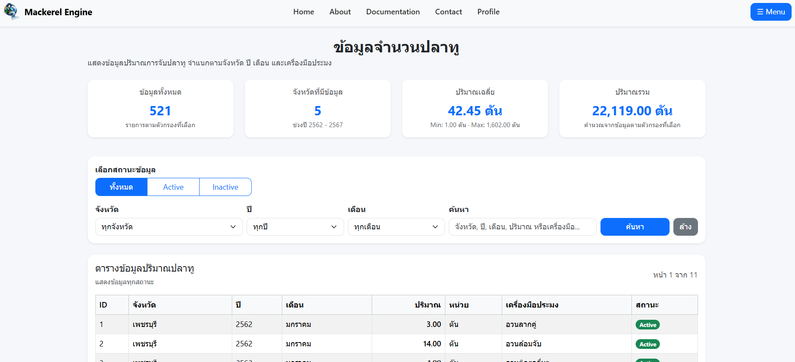
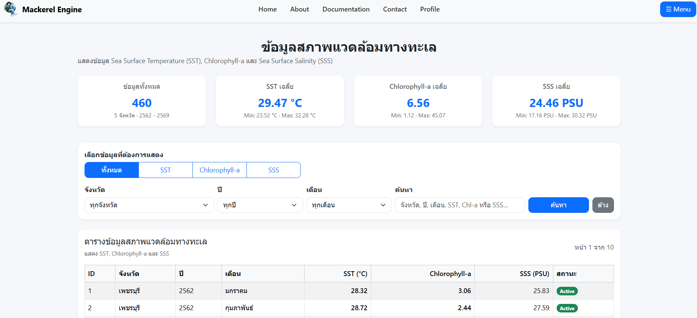
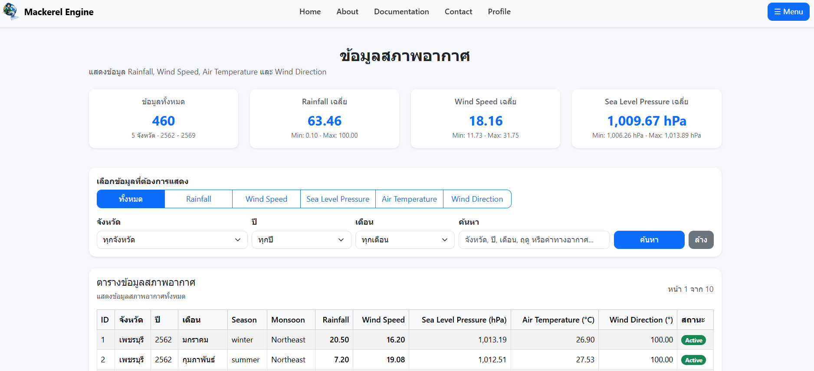
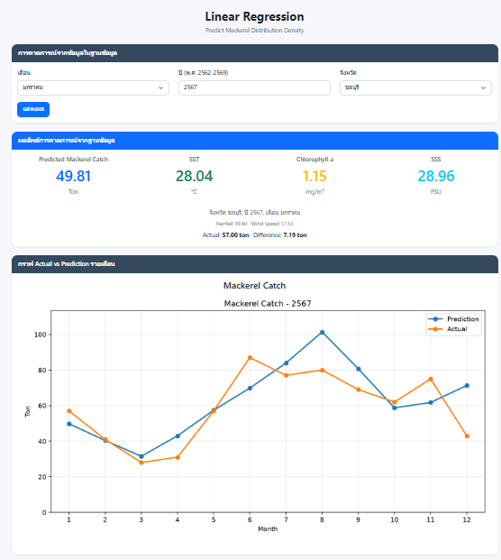
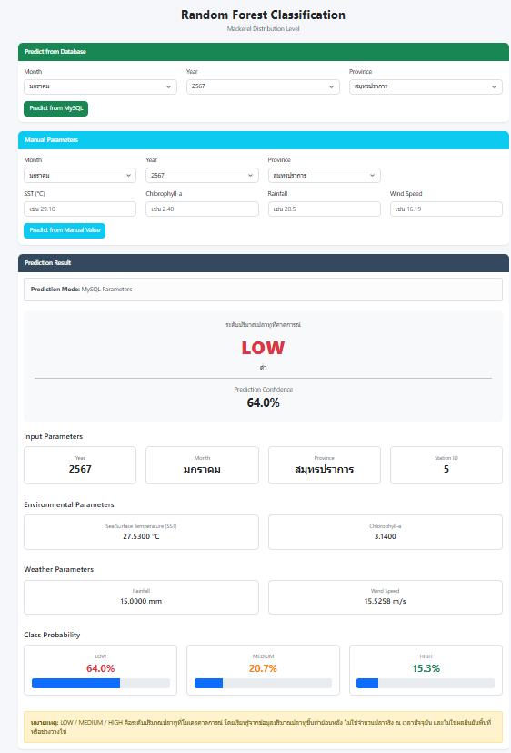
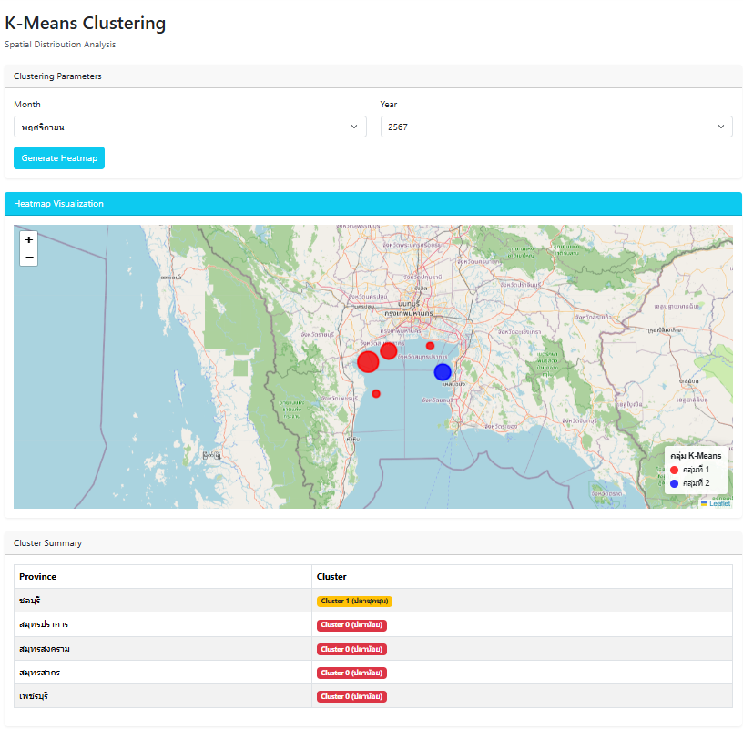

# Mackerel Distribution Prediction System

A web-based analytical system for predicting and analyzing mackerel distribution in the Gulf of Thailand using Machine Learning.

The system integrates fisheries, marine environmental, and weather data to analyze relationships between environmental factors and mackerel distribution. Three Machine Learning approaches are implemented: **Linear Regression, Random Forest Classification, and K-Means Clustering**.

This project was developed collaboratively as a university group project.

## Overview

The system processes historical mackerel catch data together with marine environmental and weather factors from multiple datasets and external APIs.

The collected data is prepared and normalized before being used for Machine Learning analysis. The results are presented through a web application that allows users to explore historical data and perform predictions based on selected parameters.

The dataset covers **5 study areas** in the Gulf of Thailand, with historical fisheries data from **2562–2567 (2019–2024)**.

## Machine Learning Models

### Linear Regression
Used to predict mackerel catch quantities based on historical and environmental data. The system also provides a comparison between predicted and actual catch values.

### Random Forest Classification
Used to classify mackerel distribution into three levels:

- **LOW**
- **MEDIUM**
- **HIGH**

Predictions can be generated using data retrieved from the database or manually entered environmental parameters.

### K-Means Clustering
Used to analyze spatial similarities between study areas and group them into clusters. The clustering results are visualized geographically using an interactive map.

## Data Used

The system combines several types of data for analysis:

**Fisheries Data**
- Mackerel catch quantity
- Province
- Month
- Year

**Marine Environmental Data**
- Sea Surface Temperature (SST)
- Chlorophyll-a
- Sea Surface Salinity (SSS)

**Weather Data**
- Rainfall
- Wind Speed
- Wind Direction
- Air Temperature
- Sea Level Pressure
- Season
- Monsoon

## Main Features

- Machine Learning-based mackerel distribution analysis
- Mackerel catch prediction using Linear Regression
- Distribution level classification using Random Forest
- Spatial analysis using K-Means Clustering
- Interactive clustering map
- Historical fisheries data archive
- Marine environmental data archive
- Weather data archive
- Filtering data by province, year, and month
- Prediction using database records
- Manual parameter prediction
- Database-driven web application

## Technologies Used

- Python
- PHP
- MySQL
- CSS
- JavaScript
- Bootstrap
- Machine Learning
- Data Analysis
- External APIs

## Screenshots

### Home

The home page provides an overview of the system, study period, study areas, Machine Learning models, and the environmental factors used for analysis.

### Fisheries Dataset

Displays historical mackerel catch records stored in the database. Users can filter the data by province, year, month, status, and keywords.

### Marine Environment Data

Displays marine environmental data used by the system, including **Sea Surface Temperature (SST), Chlorophyll-a, and Sea Surface Salinity (SSS)**.

### Weather Data

Displays weather-related variables used for data analysis, including rainfall, wind speed, sea level pressure, air temperature, wind direction, season, and monsoon.

### Linear Regression

Predicts mackerel catch quantities from historical and environmental data. The page also visualizes predicted and actual catch values across different months.

### Random Forest Classification

Classifies predicted mackerel distribution into **LOW, MEDIUM, or HIGH** levels. Predictions can use parameters retrieved from the database or values entered manually by the user.

The result also displays the prediction confidence, class probabilities, and environmental parameters used for the prediction.

### K-Means Clustering

Analyzes spatial patterns among the study areas using K-Means Clustering. Cluster results are displayed on an interactive map together with a summary of the province assigned to each cluster.

## Data Analysis and Preparation

Data preparation for the project included:

- Searching and collecting relevant datasets
- Retrieving environmental and weather data from external APIs
- Combining data from multiple sources
- Data cleaning and preprocessing
- Data normalization
- Preparing datasets for Machine Learning model training
- Organizing processed data in a MySQL database

## Project Team

### Theerapat Pokkaew
**Project Manager / Classification / Web Development**

- Project management and team coordination
- Random Forest Classification model development
- Design and development of the web application
- Development of Archive pages
- Database integration for historical data
- Home page development

### Sattaya Pokkaew
**Regression / Data Analyst**

- Linear Regression model development
- Dataset research and collection
- External API data collection
- Data preprocessing
- Data normalization
- Training data preparation

### Panyakorn Khaiwchoo
**Clustering / Data Analyst**

- K-Means Clustering model development
- Dataset research and collection
- External API data collection
- Data preprocessing
- Data normalization
- Training data preparation

## About This Project

This project was developed as a university group project to apply **Machine Learning, Data Analysis, Database Management, and Web Development** to fisheries and environmental data.

The project demonstrates a complete workflow from **data collection, preprocessing, and database management to Machine Learning analysis and web-based visualization**.
